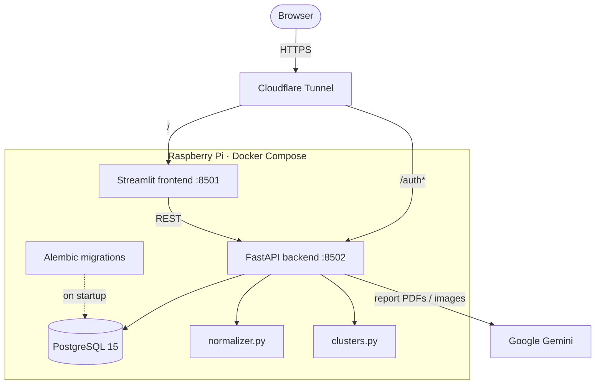

# AgeAid — Health Trend Tracker

A privacy-first AI health dashboard that extracts data from blood reports and
**reasons about it** — reading your lab history together with your lifestyle and
medical background to explain *why* a marker is moving, not just that it moved.
Self-hosted on a Raspberry Pi with Google Gemini.

## 🚀 Features

- **AI Extraction** — uses Google Gemini to read PDFs and images of lab reports.
- **Contextual Inference** — the core of the app. Correlates lab trends against
  your lifestyle, medical history, and health journal to interpret the change and
  suggest what to do about it. See [How the analysis works](#-how-the-analysis-works).
- **Trend Analysis** — visualizes cholesterol, sugar, thyroid and other markers
  over time, normalizing test names across labs that spell them differently.
- **Smart Auth** — sign in with Google (OAuth2) or email/password.
- **Privacy First** — "right to erasure" (delete account) built in, and AI
  analysis runs only with explicit user consent.
- **Cost Tracking** — monitors AI token usage per report.
- **Dockerized** — app and database run together via Docker Compose, with Alembic migrations applied on startup.

## 🧠 How the Analysis Works

A number on a lab report means little on its own. The point of this project is the
step *after* extraction: putting a result in the context of the person it belongs
to.

When you ask about a marker, the app assembles four things and reasons over them
together:

| Input | Source | Why it matters |
| --- | --- | --- |
| **Lab timeline** | every past report, grouped by date | direction and rate of change, not a single snapshot |
| **Related markers** | `clusters.py` | a lipid result is read alongside the rest of the lipid panel, not in isolation |
| **Lifestyle + profile** | signup and profile (diet, activity, alcohol, smoking, sleep, medical history, age, gender) | the same value means different things for different people |
| **Health journal** | your free-text notes ("started running", "was ill in March") | supplies the *cause* a number alone cannot explain |

Gemini then returns a trend assessment (improving or worsening), an explicit
correlation between the trend and your lifestyle and journal entries, and
actionable suggestions — always with a disclaimer to consult a doctor.

The practical difference: a chart can tell you your LDL rose 15%. This tells you
it rose over the period you recorded a diet change, that your HDL moved with it,
and what is worth discussing with your doctor.

> **Not a diagnostic tool.** Output is AI-generated interpretation, not medical
> advice, and it is only ever generated for users who opt in.

## 🛠️ Tech Stack

| Layer | Technology |
| --- | --- |
| Frontend | Streamlit (port 8501) |
| Backend | FastAPI (port 8502) |
| Database | PostgreSQL 15, running as a container |
| AI Engine | Google Gemini |
| Infrastructure | Docker Compose, Cloudflare Tunnel (for public access) |

> **Note:** this project previously ran on CockroachDB Serverless. It now uses a local
> Postgres container, so the old `root.crt` / `sslmode=verify-full` certificate setup is
> no longer needed.

## 🗺️ Architecture



## 📂 Project Structure

```
health_backend/
├── alembic/             # Database migration scripts (alembic/versions/)
├── alembic.ini          # Alembic config; connection string comes from DATABASE_URL
├── app.py               # Streamlit frontend
├── main.py              # FastAPI backend
├── database.py          # SQLAlchemy engine and session
├── models.py            # SQLAlchemy tables
├── schemas.py           # Pydantic models
├── extractor.py         # Gemini AI logic
├── normalizer.py        # Medical term normalization
├── clusters.py          # Related-test grouping
├── utils.py             # Date helpers
├── Dockerfile           # App image; runs migrations, then FastAPI + Streamlit
├── docker-compose.yml   # App + Postgres
├── deploy.sh            # Pull, rebuild, restart (Raspberry Pi)
└── .env                 # Secrets (gitignored)
```

Maintenance scripts: `check_users.py`, `clear_reports.py`, `reset_db.py`, and
`nuclear_reset.py` (destructive — drops data).

## ⚡ Quick Start

**Prerequisites:** Docker Desktop. (Python 3.11+ only if you want to run outside Docker.)

### 1. Create your `.env`

Every variable below is required. `POSTGRES_PASSWORD` **must** match the password
inside `DATABASE_URL`, since Compose uses it to initialize the database container.

```ini
# AI
GEMINI_API_KEY=your_key

# Database. The host is "db" — the Compose service name, not localhost.
POSTGRES_PASSWORD=choose_a_password
DATABASE_URL=postgresql://healthuser:choose_a_password@db:5432/healthdb

# Google OAuth
GOOGLE_CLIENT_ID=your_client_id
GOOGLE_CLIENT_SECRET=your_client_secret

# Session signing. There is no default — the app refuses to start without it.
SECRET_KEY=some_long_random_string

# URLs
ENV_TYPE=development
PUBLIC_API_URL=http://localhost:8502   # FastAPI, for browser-facing OAuth redirects
FRONTEND_URL=http://localhost:8501     # where users land after a Google login
```

In production both point at your public domain, e.g. `https://your-domain.com`.

Compose parses `.env` strictly: every non-comment line must be `KEY=value`. Stray prose
or separator lines will make `docker compose up` fail to read the file.

### 2. Run

```bash
docker compose up -d --build
```

This starts Postgres, waits for it to accept connections, applies the Alembic
migrations, then launches FastAPI and Streamlit.

Open the UI at **http://localhost:8501**.

```bash
docker compose logs -f app     # tail logs
docker compose down            # stop (keeps data)
docker compose down -v         # stop and DELETE the database volume
```

## 🍓 Raspberry Pi Deployment

```bash
git clone <repo_url>
cd health_backend
nano .env          # set ENV_TYPE=production and PUBLIC_API_URL=https://your-domain.com
./deploy.sh
```

`deploy.sh` pulls the latest code and runs `docker compose up -d --build`.

## 🔄 Database Migrations (Alembic)

Migrations run automatically on container startup. Alembic reads the connection string
from `DATABASE_URL`; it is **not** configured in `alembic.ini`.

To create a migration after changing `models.py`:

```bash
# 1. Enter the app container
docker compose exec app /bin/bash

# 2. Generate the script
alembic revision --autogenerate -m "Description of change"

# 3. Apply it
alembic upgrade heads
```

Commit the generated file in `alembic/versions/`. Keep the history to a **single head** —
if `alembic heads` prints more than one revision, `upgrade` will fail.

## 🛡️ Traffic Flow (Cloudflare Tunnel)

Route auth traffic to FastAPI and everything else to Streamlit:

| Public hostname | Origin |
| --- | --- |
| `your-domain.com/auth*` | `http://localhost:8502` (FastAPI) |
| `your-domain.com/` | `http://localhost:8501` (Streamlit) |

## 🔐 Secrets

`.env`, `keys.txt`, and the Google `client_secret_*.json` are gitignored and excluded
from the Docker image via `.dockerignore`. Never commit them — and note that adding a
secret to `.gitignore` does not remove it from history if it was committed previously.
